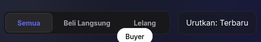

<p align="center">
  
</p>

<h1 align="center">DigiSecond</h1>
<h3 align="center">Full-Stack Marketplace Game Digital Indonesia</h3>

<p align="center">
  <strong>Jual-Beli Akun, Item, dan Layanan Game — Aman & Terpercaya</strong><br>
  Platform marketplace berbasis <em>Next.js (tRPC)</em> dan <em>Tailwind CSS</em> dengan sistem Escrow, Lelang Real-time, dan Payment Gateway terintegrasi.
</p>

<p align="center">
  
  
  
  
  
  
  
  
</p>

---

## 📋 Daftar Isi

- [Tentang DigiSecond](#tentang-digisecond)
- [Fitur & Modul](#fitur--modul)
- [Screenshot](#screenshot)
- [Arsitektur](#arsitektur)
- [Teknologi](#teknologi)
- [Instalasi](#instalasi)
- [Penggunaan](#penggunaan)
- [Struktur Proyek](#struktur-proyek)
- [Lisensi](#lisensi)

---

## 🎯 Tentang DigiSecond

**DigiSecond** adalah marketplace game digital Indonesia yang memungkinkan jual-beli **akun game, virtual item, skin, dan layanan digital** secara peer-to-peer dengan sistem **Escrow** bawaan. Platform ini menggabungkan kekuatan **Next.js + tRPC** di frontend dan **PostgreSQL (Supabase) + Prisma** di backend, menyediakan pengalaman trading yang aman, real-time, dan modern.

Setiap transaksi diamankan dengan **Escrow System** — dana pembeli ditahan hingga barang diterima dan diverifikasi, dengan jendela verifikasi 24 jam dan fitur **dispute resolution** untuk menangani sengketa.

---

## ✨ Fitur & Modul

| Modul | Deskripsi |
|---|---|
| **Marketplace Layanan** | Jelajahi listing game, filter berdasarkan game populer, tab kategori |
| **Sistem Escrow** | Dana aman hingga pembeli konfirmasi penerimaan barang |
| **Live Auction** | Lelang real-time dengan highest bid dan countdown waktu |
| **Payment Gateway** | Virtual Account, E-Wallet, QRIS (Xendit) |
| **Dispute Resolution** | Panel admin untuk meninjau dan menyelesaikan sengketa |
| **User Dashboard** | Ringkasan transaksi, aktivitas terbaru, status langganan |
| **Admin Panel** | Overview statistik, manajemen user, listing, dan transaksi |
| **Wishlist** | Simpan item favorit untuk dibeli nanti |
| **Help Center** | FAQ, form kontak, dan live chat |
| **Auth & SSO** | Login email & Google Single Sign-On |
| **Multi-Platform** | Web (Next.js) + Mobile (React Native + Expo) |

---

## 🖼️ Screenshot

### Halaman Depan

<p align="center">
  
  <br>
  <em>Homepage Dark Mode — Hero banner, pencarian, kategori game, dan listing tren terkini.</em>
</p>

<p align="center">
  
  <br>
  <em>Homepage Light Mode — Tampilan bersih dan modern dengan desain mode terang.</em>
</p>

### Marketplace & Lelang

<p align="center">
  
  <br>
  <em>Marketplace Layanan Game — Eksplorasi item, filter game populer, tab kategori.</em>
</p>

<p align="center">
  
  <br>
  <em>Halaman Lelang — Item dilelang real-time dengan highest bid dan waktu berakhir.</em>
</p>

### Auth & Profil

<p align="center">
  
  <br>
  <em>Halaman Login — Masuk akun dengan email atau Google SSO.</em>
</p>

<p align="center">
  
  <br>
  <em>Halaman Registrasi — Form pendaftaran pengguna baru.</em>
</p>

### Dashboard Pengguna

<p align="center">
  
  <br>
  <em>User Dashboard — Ringkasan total pembelian, transaksi berjalan, aktivitas terbaru, status langganan.</em>
</p>

<p align="center">
  
  <br>
  <em>Transaksi Saya — Riwayat jual-beli dengan progress bar Escrow (Bayar → Escrow → Kirim → Selesai).</em>
</p>

<p align="center">
  
  <br>
  <em>Form Buat Listing — Unggah produk baru, dukung listing publik & Private Escrow Room.</em>
</p>

<p align="center">
  
  <br>
  <em>Halaman Wishlist — Simpan item favorit, tampilan empty state saat kosong.</em>
</p>

### Admin Panel

<p align="center">
  
  <br>
  <em>Admin Overview — Statistik real-time, grafik pertumbuhan user, volume transaksi.</em>
</p>

<p align="center">
  
  <br>
  <em>Admin Disputes — Panel monitor, tinjau, dan selesaikan sengketa pembeli-penjual.</em>
</p>

<p align="center">
  
  <br>
  <em>Admin User Management — Kelola pengguna, role (pembeli/penjual/admin), status akun.</em>
</p>

<p align="center">
  
  <br>
  <em>Admin Semua Listing — Moderasi dan lihat seluruh listing marketplace.</em>
</p>

<p align="center">
  
  <br>
  <em>Admin Semua Transaksi — Rekapitulasi transaksi dengan status historis (Completed, Refunded, dll).</em>
</p>

### Fitur Tambahan

<p align="center">
  
  <br>
  <em>Marketplace Layanan Game — Tampilan alternatif mode terang.</em>
</p>

<p align="center">
  
  <br>
  <em>Pusat Bantuan — Form Hubungi Kami, FAQ, dan kontak Live Chat.</em>
</p>

<p align="center">
  
  <br>
  <em>Halaman Status Pembayaran — Integrasi payment gateway, detail tagihan, batas waktu bayar.</em>
</p>

---

## 🏗️ Arsitektur

```
┌─────────────────────────────────────────────────────────────┐
│                    Frontend (Web)                            │
│              Next.js 14 — Tailwind CSS                       │
│              TanStack Query — Zustand                        │
├─────────────────────────────────────────────────────────────┤
│                    Mobile Client                             │
│            React Native + Expo (SDK 50)                     │
│            React Native Paper                                │
├─────────────────────────────────────────────────────────────┤
│                    API Layer (tRPC)                          │
│              Type-safe RPC — NextAuth.js                    │
│              React Hook Form + Zod                           │
├─────────────────────────────────────────────────────────────┤
│                 Database & Services                          │
│     PostgreSQL (Supabase) — Prisma ORM                      │
│     Upstash Redis — Supabase Realtime                       │
│     Xendit (Payments) — MailerSend (Email)                  │
└─────────────────────────────────────────────────────────────┘
```

- **Komunikasi:** Type-safe tRPC — seluruh request diverifikasi dengan skema Zod
- **Frontend:** Next.js App Router dengan TanStack Query untuk caching & state
- **Backend:** tRPC router terstruktur dengan separation of concerns
- **Database:** PostgreSQL via Supabase dengan Prisma ORM
- **Real-time:** Supabase Realtime untuk chat dan update auction
- **Mobile:** React Native + Expo untuk akses platform lintas perangkat

---

## 🛠️ Teknologi

- **Next.js 14** — React framework (App Router)
- **TypeScript** — Bahasa pemrograman utama (type-safe)
- **Tailwind CSS 3** — Utility-first CSS framework
- **tRPC 11** — Type-safe API layer
- **Prisma 5** — ORM untuk PostgreSQL
- **PostgreSQL (Supabase)** — Database utama
- **NextAuth.js 4** — Autentikasi (Email + Google SSO)
- **Xendit** — Payment gateway (VA, E-Wallet, QRIS)
- **React Native + Expo** — Mobile client
- **TanStack Query 5** — Server state management
- **Zustand 4** — Client state management
- **React Hook Form + Zod** — Form validation
- **Upstash Redis** — Caching & rate limiting
- **Supabase Realtime** — Real-time updates
- **MailerSend** — Transactional email
- **Chart.js** — Grafik & visualisasi data
- **GSAP** — Animasi UI

---

## ⚙️ Instalasi

### Prasyarat

- **Node.js 20+** & **pnpm**
- **PostgreSQL** (atau akun Supabase)
- **Akun Xendit** (untuk payment gateway)
- **Akun MailerSend** (untuk email)

### Langkah Instalasi

```bash
# Clone repositori
git clone https://github.com/username/digisecond.git
cd digisecond

# Install dependencies
pnpm install

# Setup environment variables
cp .env.example .env
# Edit .env sesuai konfigurasi Anda (database, auth, payment)

# Setup database
pnpm db:generate
pnpm db:migrate
pnpm db:seed

# Jalankan development server (http://localhost:3000)
pnpm dev
```

Buka **http://localhost:3000** di browser Anda.

### Setup Mobile (Opsional)

```bash
cd mobile
pnpm install
pnpm start
# Scan QR code dengan Expo Go di perangkat Anda
```

---

## 🚀 Penggunaan

1. **Daftar / Login** — Buat akun baru atau masuk dengan Google SSO
2. **Jelajahi Marketplace** — Cari listing game, filter kategori, lihat detail item
3. **Beli / Tawar** — Beli fixed-price atau ikuti lelang real-time
4. **Pembayaran** — Bayar melalui Virtual Account, E-Wallet, atau QRIS
5. **Escrow** — Dana aman ditahan hingga barang diterima
6. **Konfirmasi** — Verifikasi barang dalam 24 jam, dana otomatis dirilis ke penjual
7. **Jual** — Buat listing baru, atur harga tetap atau lelang
8. **Dispute** — Laporkan masalah, admin akan meninjau dan menyelesaikan

---

## 📁 Struktur Proyek

```
digisecond/
├── src/
│   ├── app/              # Next.js App Router (pages & layouts)
│   ├── server/           # tRPC routers & business logic
│   │   └── api/routers/  # Per-module routers
│   ├── components/       # React components
│   ├── trpc/             # tRPC client setup
│   ├── lib/              # Utility functions
│   ├── types/            # TypeScript type definitions
│   └── assets/           # Images & icons
├── prisma/
│   ├── schema.prisma     # Database schema
│   └── seed.ts           # Database seeder
├── mobile/               # React Native + Expo app
├── docs/                 # Documentation & screenshots
└── scripts/              # Automation scripts
```

---

## 📄 Lisensi

Proyek ini dilisensikan di bawah **MIT License**. Lihat file [LICENSE](LICENSE) untuk detail lebih lanjut.
