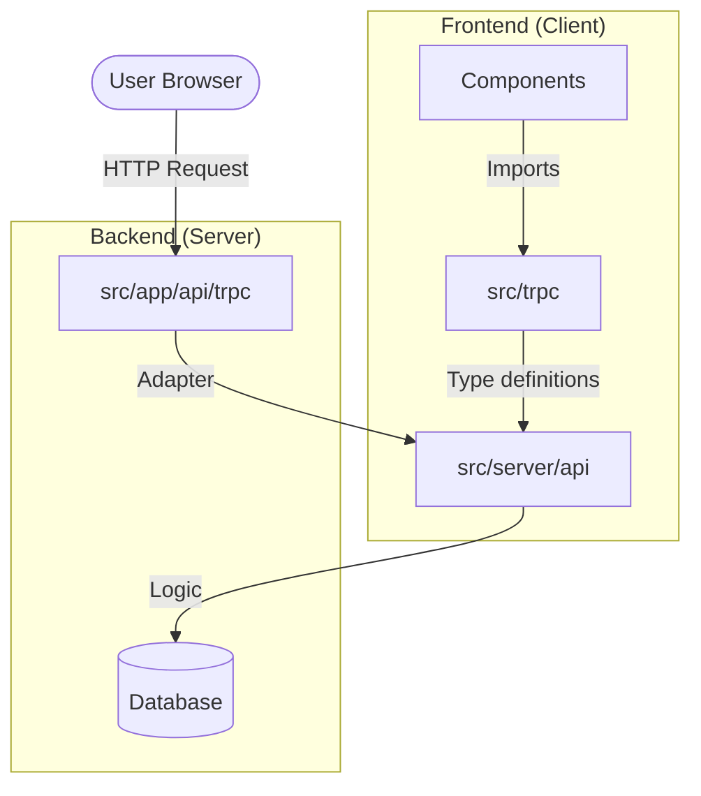

# tRPC & API Project Structure Explanation

This document clarifies the structural decisions regarding the API and tRPC folders in this project. The architecture follows the standard **T3 Stack / Next.js App Router** pattern, emphasizing separation of concerns between definition, exposure, and consumption.

## 1. `src/server/api` (The "Backend Brain")

**Purpose**: Contains the actual **Business Logic** and **Router Definitions**.

-   **Why separate?**: This is where your backend code lives. It is backend-only code that runs on the server.
-   **Key Files**:
    -   `root.ts`: Combines all sub-routers (listings, users, etc.) into one `appRouter`.
    -   `trpc.ts`: Defines reusable procedures (e.g., `publicProcedure`, `protectedProcedure`) and middleware (auth checks).
    -   `routers/`: Folder containing specific domain logic (e.g., `listing.router.ts`, `user.router.ts`).

## 2. `src/app/api/trpc/[trpc]` (The "HTTP Gateway")

**Purpose**: This is the **Next.js Route Handler** (Adapter).

-   **Why separate?**: Next.js App Router needs to know *how* to handle incoming HTTP requests at a specific URL (`/api/trpc/*`).
-   **Function**: It acts as a bridge. It takes an incoming HTTP request, passes it to your `appRouter` (defined in `server/api`), and returns the response. It doesn't contain business logic; it just "plugs" tRPC into Next.js.
-   **Analogy**: Think of this as the "Front Door" of the server that lets HTTP traffic in.

## 3. `src/trpc` (The "Client SDK" / Glue)

**Purpose**: Contains **Client-Side Helpers** and **React Hooks** to consume the API.

-   **Why separate?**: This code runs primarily on the **Client** (Browser) or handles Server-Side Rendering (SSR) pre-fetching functions.
-   **Key Files**:
    -   `react.tsx` (or `client.ts`): Creates the standard `api` hook (e.g., `api.listing.getAll.useQuery()`). It brings the type-safety from the server to your frontend components.
    -   `server.ts`: (Optional) Helpers for calling tRPC procedures directly from React Server Components (RSC) without making an HTTP request.

## Summary Diagram

## 4. FAQ: Why not merge these into one folder?

Technically possible via hacks, but **strongly discouraged** and dangerous for three reasons:

1.  **Next.js App Router Rules (The "Must" reason)**
    -   Next.js **enforces** that HTTP route handlers live in `src/app/api/...`. We cannot move `route.ts` to `src/server` because Next.js won't find it there to create the URL endpoint. This forces at least one separation.

2.  **Security & The "Server-Client Boundary" (The "Critical" reason)**
    -   `src/server` contains sensitive code (Database connections, Secret Keys, Validations).
    -   `src/trpc` contains client code bundled to the browser.
    -   If these files were mixed in one folder, it becomes very easy to accidentally import server code into a client component. Next.js is smart enough to throw a build error ("Module not found: fs/net"), but worse cases involve accidentally leaking secret logic to the client bundle. Separating folders enforces a physical barrier.

3.  **Cyclic Dependencies**
    -   The Router imports the Database. The Client imports the Router type definitions. If everything is in one place, you often run into circular import issues that crash the build.

**Conclusion**:
- **Logic** goes in `src/server/api`.
- **Routing** goes in `src/app/api` (just the entry point).
- **Consumption** tools go in `src/trpc`.
