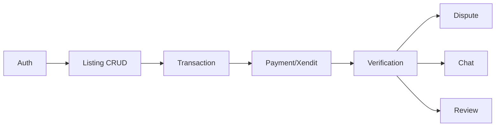

# DigiSecond MVP - Implementation Milestones

> **Timeline**: 2 weeks | **Team**: 3 devs (Backend, Web, Mobile)  
> **Branch Strategy**: `backend`, `frontend-web`, `mobile` → merge to `main`

---

## Week 1: Foundation + Core Transaction Flow

### Day 1-2: Project Setup & Auth

| Role | Tasks | Deliverables |
|------|-------|--------------|
| **Backend** | Prisma schema (User, Listing, Category), NextAuth setup, Google OAuth | `pnpm prisma migrate dev` works, login endpoint |
| **Web** | Next.js project, Tailwind config, tRPC client, auth pages | Login/register UI, Google button |
| **Mobile** | Expo init, Paper theme, tRPC client, auth screens | Login/register screens |

**Sync Point**: All can login via Google OAuth ✓

---

### Day 3-4: Listing CRUD

| Role | Tasks | Deliverables |
|------|-------|--------------|
| **Backend** | `listing.create`, `listing.search`, `listing.getById`, photo upload to Supabase | Tests passing |
| **Web** | Create listing form, listing grid, listing detail page | Form submits, grid renders |
| **Mobile** | Create listing screen, listing list, listing detail | Photo picker works |

**Sync Point**: Can create and view listings on both platforms ✓

---

### Day 5: Search & Categories

| Role | Tasks | Deliverables |
|------|-------|--------------|
| **Backend** | Category seeding, search filters (price, category), pagination | Search <500ms |
| **Web** | Search bar, filter sidebar, sort dropdown | Filters work |
| **Mobile** | Search screen, filter modal | Pull-to-refresh |

**Sync Point**: Search works across platforms ✓

---

## Week 2: Payments + Escrow + Polish

### Day 6-7: Transaction & Payment

| Role | Tasks | Deliverables |
|------|-------|--------------|
| **Backend** | `transaction.create`, Xendit invoice creation, webhook handler, Payment model | Webhook tested via ngrok |
| **Web** | Buy Now button, payment instructions page, transaction status page | Payment flow UI |
| **Mobile** | Purchase flow, payment webview/deep link, transaction screen | Can complete payment |

**Sync Point**: Complete a test purchase with real Xendit sandbox ✓

---

### Day 8-9: Verification & Escrow

| Role | Tasks | Deliverables |
|------|-------|--------------|
| **Backend** | `transaction.markTransferred`, `transaction.confirmReceived`, auto-release cron, fund release logic | Cron job running |
| **Web** | Seller dashboard (pending transfers), buyer verification page, countdown timer | Timer accurate |
| **Mobile** | Transfer confirmation screen, verification screen | Push notification stub |

**Sync Point**: Full happy-path: purchase → transfer → confirm → complete ✓

---

### Day 10: Dispute Flow

| Role | Tasks | Deliverables |
|------|-------|--------------|
| **Backend** | `dispute.create`, `dispute.resolve`, pause auto-release, evidence upload | Dispute pauses timer |
| **Web** | Report issue button, dispute form, evidence upload | Admin can view queue |
| **Mobile** | Report issue screen | Evidence photo upload |

**Sync Point**: Buyer can dispute, admin can resolve ✓

---

### Day 11: Chat & Reviews

| Role | Tasks | Deliverables |
|------|-------|--------------|
| **Backend** | `message.send`, Supabase Realtime subscription, `review.create` | Real-time works |
| **Web** | Chat UI in transaction page, review modal | Messages appear live |
| **Mobile** | Chat screen, review screen | Keyboard handling |

**Sync Point**: Chat works in real-time, reviews update ratings ✓

---

### Day 12-13: Polish & Edge Cases

| Role | Tasks | Deliverables |
|------|-------|--------------|
| **Backend** | Rate limiting, ban checks, input sanitization, error messages | All edge cases handled |
| **Web** | Loading states, error boundaries, empty states, responsive fixes | Mobile-responsive |
| **Mobile** | Offline handling, biometric login stub, deep linking | App Store ready UI |

**Sync Point**: All critical edge cases from spec covered ✓

---

### Day 14: Testing & Launch Prep

| Role | Tasks | Deliverables |
|------|-------|--------------|
| **Backend** | E2E test suite, seed data script, production env setup | `pnpm test:e2e` passes |
| **Web** | Cross-browser testing, Lighthouse audit, Vercel deploy | Deployed to staging |
| **Mobile** | Device testing, EAS preview build | TestFlight/Internal testing ready |

**Sync Point**: Staging environment live, all E2E tests pass ✓

---

## Milestone Checklist (for task.md)

```markdown
## Week 1
- [ ] Day 1-2: Auth (Google OAuth working)
- [ ] Day 3-4: Listing CRUD (create + view)
- [ ] Day 5: Search & filters

## Week 2
- [ ] Day 6-7: Payment flow (Xendit sandbox)
- [ ] Day 8-9: Verification & escrow
- [ ] Day 10: Dispute flow
- [ ] Day 11: Chat & reviews
- [ ] Day 12-13: Polish & edge cases
- [ ] Day 14: Testing & deploy
```

---

## Critical Path (Blockers)



If any of these block, the whole timeline shifts. Prioritize in this order.

---

## Daily Standups

Quick sync format (5 min max):
1. What I finished yesterday
2. What I'm doing today
3. Am I blocked on anyone?

---

## Shared Code Coordination

| File | Owner | Others: Ask before editing |
|------|-------|---------------------------|
| `prisma/schema.prisma` | Backend | Web, Mobile |
| `src/lib/schemas.ts` | Backend | Web, Mobile |
| `src/server/api/root.ts` | Backend | - |
| `.agent/skills/shared-design-tokens` | Web | Mobile |
